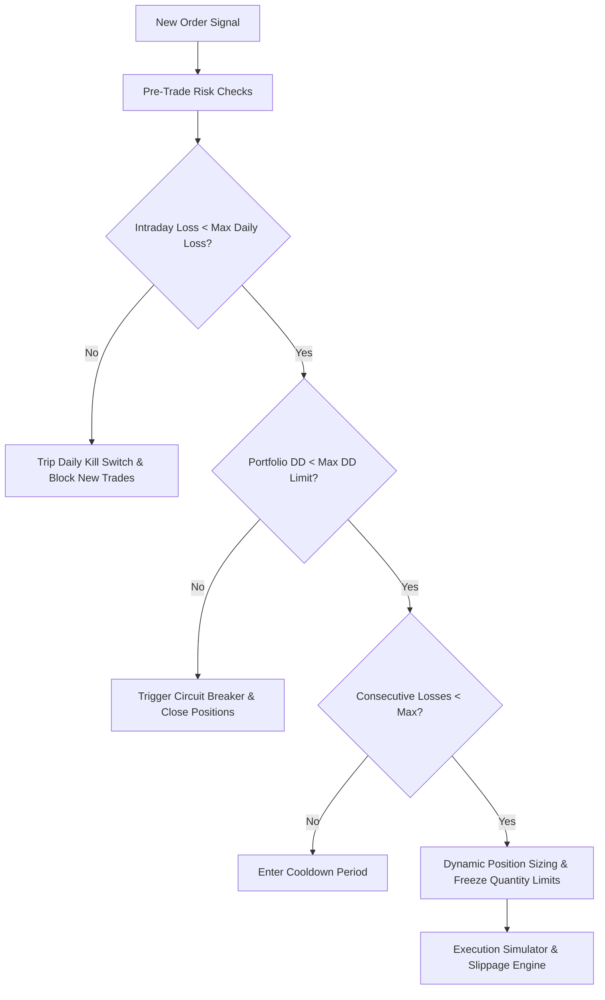

# Universal Quantitative Testing Engine (stocks-engine / testing-engine)

[](https://www.python.org/downloads/)
[](LICENSE)
[]()
[]()
[]()
[]()

Institutional-grade, event-driven quantitative backtesting, optimization, and real-time simulation terminal designed for Indian equity, index, futures, and derivative markets (NSE/BSE). Powered 100% by real recorded sub-second market data archives, hardware-accelerated indicators, next-gen multi-sampling mass iteration (LHS, Bayesian TPE, Sobol), 56 institutional strategies, and an interactive Bloomberg-style dark glassmorphism terminal.

---

## Table of Contents

1. [Key Features & Capabilities](#key-features--capabilities)
2. [Hardware Acceleration & Vectorized Mathematical Core](#hardware-acceleration--vectorized-mathematical-core)
3. [Next-Gen Mass Iteration Engine](#next-gen-mass-iteration-engine)
4. [56 Institutional Strategies Catalog & Composable Engine](#56-institutional-strategies-catalog--composable-engine)
5. [Advanced Trade Lifecycle Simulator](#advanced-trade-lifecycle-simulator)
6. [Multi-Dimensional Matrix Analytics & Session Store](#multi-dimensional-matrix-analytics--session-store)
7. [Historical 255-Day NSE Macro Data Loader & AI Evaluators](#historical-255-day-nse-macro-data-loader--ai-evaluators)
8. [Universal Multi-Instrument Architecture](#universal-multi-instrument-architecture)
9. [Dual-Mode Database Engine](#dual-mode-database-engine)
10. [Execution Realism & Statutory Taxes](#execution-realism--statutory-taxes)
11. [Institutional Risk Engine](#institutional-risk-engine)
12. [Optimization & Walk-Forward Suite](#optimization--walk-forward-suite)
13. [Quantitative Validation & Anti-Overfitting Suite](#quantitative-validation--anti-overfitting-suite)
14. [Web Terminal Dashboard & Mass Iteration Lab](#web-terminal-dashboard--mass-iteration-lab)
15. [Testing & Quality Assurance (106 Tests)](#testing--quality-assurance-106-tests)
16. [License](#license)

---

## Key Features & Capabilities

1. **Strictly Zero Mock Data**:
   - Every tick, bar, trade, fill, fee, and MTM valuation is dynamically derived from real historical recordings (`equities.db`, `indices.db`, `trade.db`, `options_tick.db`, `market_depth_20.db`).

2. **Universal Instrument Agnosticism**:
   - Seamlessly trades **Cash Equities**, **Indices**, **Index Futures**, **Stock Futures**, **Index Options (CE/PE)**, and **Stock Options** across NIFTY, BANKNIFTY, FINNIFTY, MIDCPNIFTY, SENSEX, and NSE equity constituents.

3. **Dual-Mode SQLite Ingestion**:
   - Automatically detects and transparently queries both **Legacy per-instrument schemas** (`eq_*`, `opt_*`, `fut_*`, `idx_*`) and **Unified modern schemas** (`equity_ticks`, `option_ticks`, `equity_ohlc`, `option_ohlc`).

4. **High-Speed Apache Parquet Caching**:
   - Zero-copy conversion of raw SQLite tick tables into optimized compressed Parquet stores (`cache/parquet/`), yielding **50x–100x query speedups** on subsequent multi-day backtest runs.

5. **Point-in-Time Contract Master & Expiry Engine**:
   - Incorporates historical NSE lot size revisions (e.g., NIFTY 50 $\rightarrow$ 25 $\rightarrow$ 75; BANKNIFTY 25 $\rightarrow$ 15 $\rightarrow$ 30), contract strike steps, tick sizes, freeze quantity ceilings, and NSE trading holiday adjustments with preceding-day expiry shifts.

6. **Order Book Depth-Walking & Realistic Friction**:
   - Models fills against true Level 2 20-depth order books (`market_depth_20.db`), dynamic bid-ask spread models, execution latency delays, and full statutory Indian taxes (STT, Exchange Turnover Charges, GST, SEBI Turnover, Stamp Duty, and **STT on exercised in-the-money options at expiry**).

7. **Institutional Risk Management & Kill Switches**:
   - Enforces max daily intraday loss circuit breakers, portfolio drawdown kill switches, consecutive loss cooldown delays, dynamic position sizing, and lookahead-bias-free execution queues.

8. **Multi-Core Grid Optimization**:
   - Multi-threaded parallel grid search with coarse-to-fine parameter refinement, early stopping, and automatic persistence into SQLite (`results/results.db`).

9. **Deflated Sharpe & Anti-Overfitting Validation**:
   - Institutional validation suite calculating Bailey & López de Prado's **Deflated Sharpe Ratio (DSR)**, **Probability of Backtest Overfitting (PBO)** via Combinatorially Symmetric Cross-Validation (CSCV), **Monte Carlo Permutation Bootstrap** (95% VaR & 95% worst drawdown), and **Walk-Forward Efficiency (WFE)**.

10. **Bloomberg-Style Dark Glassmorphism Terminal**:
    - Real-time interactive browser UI running on port `5690` featuring Cumulative Equity, Underwater Drawdown curves, live parameter optimization, trade logs, and institutional HTML tear-sheets.

---

## Hardware Acceleration & Vectorized Mathematical Core

Located in `math_engine/`, the mathematical subsystem transparently leverages NVIDIA GPUs via **CuPy** when CUDA is detected, automatically falling back to optimized SIMD **NumPy** arrays on CPU:

- **Hardware Layer (`math_engine/hardware.py`)**:
  - `detect_hardware()` auto-probes CUDA GPU driver, VRAM, and CuPy availability.
  - Exposes zero-copy GPU $\leftrightarrow$ CPU array conversions via `to_array()` and `to_cpu()`.
- **Vectorized Indicator Suite (`math_engine/indicator_engine.py`)**:
  - **Wilder RSI**: Classical smoothed RSI matching live NSE terminal charts.
  - **SuperTrend**: Volatility breakout bands with stateful trend flips.
  - **EMA / SMA / WMA / Hull MA**: Fast vectorized convolution and exponential decay.
  - **VWAP & Anchored VWAP**: Cumulative price-volume weighting.
  - **ADX & Directional Movement**: Trend strength and directional indicators.
  - **Bollinger Bands & %B**: Volatility compression/expansion metrics.
  - **ATR (Average True Range)**: True range calculation.
  - **Stochastic Oscillator & %K/%D**: Momentum extremes.
  - **Williams %R & CCI**: Overbought/oversold indicators.
  - **On-Balance Volume (OBV)**: Volume flow dynamics.
  - **Candle Anatomy Engine**: Vectorized extraction of body heights, upper/lower wicks, and body-to-range ratios.

---

## Next-Gen Mass Iteration Engine

Located in `engine/mass_optimizer.py`, `engine/shared_memory.py`, and `engine/bayesian_tpe.py`, this subsystem scales strategy parameter exploration across tens of thousands of runs:

1. **Multi-Sampling Strategies**:
   - **Latin Hypercube Sampling (`LHS`)**: Stratified sampling across discrete and continuous parameter axes, guaranteeing uniform coverage without empty subspaces.
   - **Bayesian Optimization (`BAYESIAN_TPE`)**: Tree-structured Parzen Estimator. Splits trials into top quantile $\ell(x)$ and remainder $g(x)$, fitting kernel density estimates and sampling candidates maximizing Expected Improvement $\ell(x)/g(x)$.
   - **Sobol Sequences (`SOBOL`)**: Low-discrepancy quasi-random sequences with high uniformity and Van der Corput fallback.
   - **Cartesian Grid (`GRID`)**: Exhaustive full factorial search.
   - **Uniform Random (`RANDOM`)**: Unbiased Monte Carlo parameter exploration.
2. **Successive Halving / Multi-Fidelity Early Pruning**:
   - Evaluates all candidate configurations on an initial 30% sample of dates.
   - Automatically prunes bottom 50% underperforming configurations (negative PnL, low Sharpe).
   - Advances only top 50% candidates to evaluate across 100% of historical dates.
   - **Results in a 4x–8x reduction in total compute time.**
3. **Zero-Copy In-Memory Bar Cache (`engine/shared_memory.py`)**:
   - `SharedBarCache` stores resampled multi-day candle arrays in memory across worker threads.
   - Completely eliminates redundant SQLite disk reads across parameter sweep iterations.
4. **Live SSE Progress Streaming**:
   - Thread-safe event queue providing real-time percentage progress, elapsed seconds, ETA, and live best-candidate stats to the web dashboard.

---

## 56 Institutional Strategies Catalog & Composable Engine

Located in `strategies/builtin/` and `strategies/composable.py`, providing 56 production-grade strategies spanning 5 core institutional disciplines:

- **Options Suite (12 Strategies)**:
  `options_flow_momentum`, `pcr_extreme_reversal`, `iv_expansion_breakout`, `straddle_premium_decay`, `gamma_scalp_momentum`, `theta_harvest_slope`, `option_buyer_vwap_cross`, `expiry_pinning_magnet`, `volatility_crush_reversion`, `max_pain_convergence`, `oi_buildup_trend`, `option_breakout_consolidation`.
- **Index Suite (13 Strategies)**:
  `orb_15min_breakout`, `orb_30min_expansion`, `cpr_pivot_reversal`, `camarilla_pivot_breakout`, `ttm_squeeze_pro`, `supertrend_multi_tf`, `ema_ribbon_alignment`, `vwap_band_pinch`, `gap_fill_fade`, `nifty_internals_breadth`, `heikin_ashi_trend_rider`, `fii_dii_cash_momentum`, `india_vix_divergence`.
- **Equities Suite (13 Strategies)**:
  `equity_momentum_rsi_ema`, `vwap_institutional_bounce`, `connors_rsi2_pullback`, `volume_price_action_breakout`, `donchian_channel_turtle`, `keltner_channel_momentum`, `stochastic_rsi_crossover`, `macd_histogram_acceleration`, `relative_strength_alpha`, `hull_ma_direction_flip`, `ichimoku_cloud_breakout`, `linear_regression_slope`, `bollinger_percent_b_reversal`.
- **Futures Suite (12 Strategies)**:
  `futures_vsa_climactic`, `order_flow_imbalance`, `futures_basis_momentum`, `vwap_value_area_poc`, `atr_volatility_expansion`, `futures_oi_divergence`, `parabolic_sar_momentum`, `multi_day_breakout`, `futures_momentum_pinbar`, `choppiness_breakout`, `futures_vwap_envelope_reversion`, `futures_dual_thrust`.
- **AI & Macro Suite (6 Strategies)**:
  `ai_replay` (Gemini decision replay), `fii_flow_momentum`, `vol_regime`, `momentum_rsi`, `vwap_reversion`, `options_flow`.
- **Composable Rule-Tree Builder (`strategies/composable.py`)**:
  - Visual/programmatic rule construction using `RuleNode`, `RuleCondition`, and `RuleAction`.
  - Supports threshold ranges, moving average crosses, and multi-indicator logical combinators (`AND` / `OR`).

---

## Advanced Trade Lifecycle Simulator

Located in `execution/trade_simulator.py`, the simulator models realistic intraday execution:

- **6-Rung Dynamic Trailing Stop-Loss (TSL) Ladder**:
  - Automatically moves stop-loss to Breakeven at +15 pts.
  - Progressively trails: +10 pts locked at +20 pts gain; +20 pts locked at +30 pts gain; +35 pts locked at +50 pts gain; +55 pts locked at +75 pts gain; +80 pts locked at +100 pts gain.
- **75% Partial Profit Booking**:
  - Closes 75% of contract lots at target price, trailing remaining 25% runner contracts for unlimited upside.
- **Time-Based Max Holding & Expiry Square-Off**:
  - Enforces mandatory intraday square-off before 15:15 IST and configurable max trade holding durations.
- **Cooldown Delays**:
  - Prevents emotional revenge trading by locking entry for $N$ bars after any loss.

---

## Multi-Dimensional Matrix Analytics & Session Store

Located in `analytics/matrix_analyzer.py` and `analytics/session_store.py`:

- **2D Heatmap Matrices**: Evaluates any pair of parameters (`param_x` vs `param_y`) against Net PnL, Sharpe, or Win Rate.
- **Parameter Sensitivity Analysis**: Computes Pearson correlation and variance across parameters to pinpoint the dominant alpha driver.
- **3D Scatter & Pareto Frontier**: Visualizes trade-offs between Net PnL, Sharpe Ratio, and Win Rate.
- **Monte Carlo Trade Reshuffling**: Shuffles historical trade sequences 1,000+ times to project probability distributions of final equity, maximum drawdowns, and 95th percentile risk.
- **Persistent Disk Session Catalog**:
  - Saves completed mass sweep experiments to `results/sessions/<session_id>.json`.
  - Maintains `results/sessions/_index.json` for persistent storage and retrieval across engine restarts.

---

## Historical 255-Day NSE Macro Data Loader & AI Evaluators

Located in `data/nse_macro_loader.py` and `strategies/builtin/ai/`:

- **NSE Macro Loader (`data/nse_macro_loader.py`)**:
  - Seamlessly ingests 255+ trading days from `nse_scrapper/NSE_Database/`.
  - Reads equity bhavcopies, F&O participant open interest (Client, DII, FII, Pro), institutional cash flows, and India VIX.
- **Online AI Engine (`strategies/builtin/ai/online_ai.py`)**:
  - Connects to Yantra Gateway (Gemini 2.5 Flash / DeepSeek) using dedicated testing API keys, with local response caching.
- **Local AI Engine (`strategies/builtin/ai/local_ai.py`)**:
  - Connects to local Ollama instances (`http://localhost:11434`) for offline neural model backtesting.

---

## Universal Multi-Instrument Architecture

The testing engine is built from the ground up to be instrument-agnostic:

| Asset Class | Symbols Supported | Strike Interval | Lot Size History | Contract Lifecycle |
| :--- | :--- | :--- | :--- | :--- |
| **Cash Equities** | Any NSE/BSE Equity (RELIANCE, INFY, TCS, HDFCBANK, etc.) | N/A | 1 share (unit-based) | Intraday (square-off 15:15) |
| **Indices** | NIFTY, BANKNIFTY, FINNIFTY, MIDCPNIFTY, SENSEX | 50 / 100 / 25 / 100 | Point-in-time lookup | Synthetic underlying feeds |
| **Futures** | Index & Stock Futures (FUTIDX, FUTSTK) | N/A | Point-in-time lot lookup | Expiry rollover & square-off |
| **Options** | European Call & Put Options (CE/PE) | Point-in-time strike steps | Point-in-time lot lookup | Physical/Cash expiry STT |

### Point-in-Time Lot Sizing Engine (`data/instrument_master.py`)
NSE lot sizes change over time. The engine automatically looks up the precise lot size based on the backtest session date:
```python
from data.instrument_master import InstrumentMaster

lot = InstrumentMaster.get_lot_size("NIFTY", as_of_date="2026_09_11")      # 25
lot = InstrumentMaster.get_lot_size("NIFTY", as_of_date="2024_04_01")      # 50
lot = InstrumentMaster.get_lot_size("BANKNIFTY", as_of_date="2026_09_11")  # 15
freeze = InstrumentMaster.get_freeze_qty("NIFTY")                          # 1,800 units
```

### Dynamic Expiry Calendar (`data/expiry_calendar.py`)
Computes weekly and monthly expiration dates, automatically accounting for NSE trading holidays and shifting expirations to the preceding active trading session:
```python
from data.expiry_calendar import ExpiryCalendar

expiry = ExpiryCalendar.get_next_expiry("NIFTY", from_date="2026_09_11", weekly=True)
is_exp = ExpiryCalendar.is_expiry_day("2026_09_11", "NIFTY")
```

---

## Dual-Mode Database Engine

Recorded market archives can arrive in either the legacy per-instrument schema or the modern unified relational schema. The `DataLoader` seamlessly detects and queries either format without requiring manual migration:

### Modern Unified Relational Schema
- `equities.db`: `equity_ticks` and `equity_ohlc` with a `security_id` foreign key.
- `options_tick.db`: `option_ticks` and `option_ohlc` with `strike_price`, `option_type`, and `expiry_date`.
- `indices.db`: `index_ticks` and `index_ohlc`.

### Legacy Per-Instrument Schema
- `equities.db`: Individual tables per instrument, e.g. `eq_2885_RELIANCE`, `eq_1594_INFY`.
- `options_tick.db`: Tables formatted as `opt_{security_id}_{symbol}_{expiry}_{strike}_{opt_type}`.
- `indices.db`: Tables formatted as `idx_1_NIFTY50`, `idx_2_NIFTYBANK`.

### High-Speed Apache Parquet Cache
Enable caching in `config.yaml` (`caching.enable_parquet_cache: true`) to automatically serialize raw SQLite ticks into compressed columnar Parquet files on first access:
```
cache/parquet/
├── 2026_09_11/
│   ├── equities_ticks.parquet
│   ├── options_ticks.parquet
│   └── indices_ticks.parquet
```

---

## Execution Realism & Statutory Taxes

The execution simulator (`execution/simulator.py`) eliminates paper-trading discrepancies by enforcing institutional market micro-structure constraints:

### 1. Level 2 Order Book Depth Walking
When `market_depth_20.db` is present, large orders walk through the actual 20-level order book bids and asks, computing volume-weighted execution prices ($P_{VWAP} = \frac{\sum P_i Q_i}{\sum Q_i}$).

### 2. Slippage Models
- `fixed`: Constant point or percentage slippage.
- `spread_pct`: Slippage calculated as a function of the prevailing bid-ask spread.
- `depth_walk`: Dynamic book traversal based on available liquidity.

### 3. Execution Latency
Simulates real order gateway delays (e.g. 100ms–500ms) by queuing orders and executing them against future market ticks.

### 4. Comprehensive Indian Statutory Taxes
Calculates all mandatory transaction taxes on every filled order:
- **Securities Transaction Tax (STT)**:
  - Equity Delivery: 0.1% on buy & sell
  - Equity Intraday: 0.025% on sell
  - Futures: 0.02% on sell
  - Options (Normal): 0.1% on sell premium
  - **Options (Exercised ITM at Expiry)**: 0.125% of the total intrinsic settlement value ($Strike \times Qty$)
- **Exchange Turnover Charges**: NSE standard transaction charges.
- **GST**: 18% on (Brokerage + Exchange Charges + SEBI Turnover).
- **SEBI Turnover Fee**: ₹10 per crore.
- **Stamp Duty**: State stamp duty on buy turnover.

---

## Institutional Risk Engine

Housed in `execution/risk_manager.py` and `execution/portfolio.py`, the risk engine provides institutional circuit breakers:



- **Intraday Kill Switch**: When daily loss reaches `max_daily_loss_pct` (e.g. 3.0%), all active positions are squared off and trading ceases for the day.
- **Portfolio Circuit Breaker**: If total account drawdown breaches `max_drawdown_pct` (e.g. 10.0%), all operations halt immediately.
- **Consecutive Loss Cooldown**: Pauses trade entry for $N$ bars after 3 consecutive losing trades.
- **Lookahead Bias Defense**: Entry orders generated on bar $t$ can only be filled on bar $t+1$ at opening price or next tick.
- **Intraday EOD Square-Off**: Automatic square-off at 15:15 IST prevents overnight gap risk.

---

## Optimization & Walk-Forward Suite

### Parallel Grid Optimizer (`engine/optimizer.py`)
Executes parameter combinations concurrently across multi-core processors using thread/process workers. Supports:
- **Exhaustive Grid Search**: Full permutation scan.
- **Coarse-to-Fine Search**: Wide-step reconnaissance followed by dense neighborhood refinement around the top 5 candidates.
- **Early Stopping**: Aborts non-viable parameter sets that fail early drawdown thresholds.
- **Automatic SQLite Persistence**: Stores all evaluated parameter sets and metrics in `results.db`.

```bash
# Run multi-core optimization on ORB strategy across dates
python cli.py optimize orb --dates 2026_09_02,2026_09_08,2026_09_11 --rank-by sharpe
```

### Walk-Forward Analysis (`engine/walk_forward.py`)
Evaluates out-of-sample robustness by rolling in-sample (train) and out-of-sample (test) windows:
- **Rolling Window**: Fixed window moving forward in time.
- **Anchored Window**: Expanding in-sample history.
- **Walk-Forward Efficiency (WFE)**: Computes the ratio of out-of-sample annualized return to in-sample return:
  $$WFE = \frac{\text{Annualized Return}_{OOS}}{\text{Annualized Return}_{IS}}$$
  *(A WFE score $> 50\%$ indicates strong out-of-sample generalization).*

```bash
# Run 3-split walk-forward analysis
python cli.py walk-forward --strategy orb --dates 2026_09_02,2026_09_08,2026_09_09,2026_09_10,2026_09_11 --splits 3
```

---

## Quantitative Validation & Anti-Overfitting Suite

Implemented in `analytics/validation.py` and `analytics/validation_report.py`, the engine implements leading statistical safeguards to protect capital against backtest data snooping:

### 1. Deflated Sharpe Ratio (DSR)
Following Bailey & López de Prado (2014), DSR adjusts the observed Sharpe ratio for:
- Number of strategy parameter trials tested ($N$)
- Variance of trial results
- Skewness and kurtosis (fat tails) of returns
- Effective sample length
Outputs a statistically sound p-value confirming whether the strategy's Sharpe is genuine alpha or random luck.

### 2. Probability of Backtest Overfitting (PBO) via CSCV
Uses **Combinatorially Symmetric Cross-Validation (CSCV)** to partition $T$ periods into $S$ sub-matrices, generating $C(S, S/2)$ permutations of training and testing splits. PBO computes the probability that the best in-sample strategy performs worse than the median out-of-sample. A candidate passes only if $PBO < 30\%$.

### 3. Monte Carlo Permutation Bootstrap
Reshuffles realized trade return distributions over 1,000 bootstrap iterations to calculate:
- **95% Value-at-Risk (VaR)**
- **95% Worst Drawdown**
- **Monte Carlo Win Probability**

### 4. Institutional Hurdle Scorecard (`CandidateValidator`)
Generates an institutional score (0–100%) and a definitive **PASS / MARGINAL / FAIL** verdict against institutional criteria:

```bash
# Validate strategy against institutional statistical hurdles
python cli.py validate orb --dates 2026_09_02,2026_09_08,2026_09_11
```

```
┌───────────────── 🛡️ Quantitative Validation Tear-Sheet ──────────────────┐
│ Strategy: Opening_Range_Breakout_15M | Score: 100.0% | Verdict: PASS     │
│ Deflated Sharpe: 2.14 (p-value: 0.0012) | Status: STATISTICALLY_SOUND    │
│ Monte Carlo VaR 95%: ₹420.00 | 95% Worst DD: 1.84% | Win Prob: 82.5%     │
└──────────────────────────────────────────────────────────────────────────┘
```

---

## Directory Structure

```
testing-engine/
├── config.yaml                 # Master institutional YAML configuration
├── config.py                   # Central settings loader & backwards compatibility
├── requirements.txt            # Python dependencies
├── cli.py                      # Standalone CLI with Rich terminal formatting
├── README.md                   # Complete architectural and operational manual
│
├── data/                       # Universal data ingestion, caching, and schemas
│   ├── archive_manager.py      # Archive scanner, RAR/ZIP discovery, folder extraction
│   ├── data_loader.py          # Unified & Legacy dual-mode SQLite data layer
│   ├── instrument_master.py    # Point-in-time lot sizing, strike steps, tick sizes
│   ├── expiry_calendar.py      # Weekly/monthly expiry & NSE holiday schedule
│   ├── ohlc_resampler.py       # High-speed sub-second tick-to-OHLC resampler
│   ├── option_chain_loader.py  # Option chain loader with StrikeSelector (offset/liquidity)
│   ├── parquet_cache.py        # Apache Parquet columnar caching engine
│   ├── quality_auditor.py      # Missing bar, gap, stale tick, & sanity auditor
│   └── watchlist.json          # Constituent symbols and security ID mappings
│
├── execution/                  # Microstructure execution and portfolio accounting
│   ├── order.py                # Order, Trade, and Position data models
│   ├── portfolio.py            # Equity tracking, MTM, sizing, freeze limits, SL priority
│   ├── risk_manager.py         # Intraday kill switch, DD circuit breaker, cooldowns
│   └── simulator.py            # Level 2 Depth-Walk, slippage models, latency, Indian taxes
│
├── strategies/                 # Strategy algorithms & parameter schemas
│   ├── base_strategy.py        # Strategy lifecycle interface & ParamSpec integration
│   ├── orb_breakout.py         # Opening Range Breakout (ORB)
│   ├── supertrend_trend.py     # Supertrend multi-factor trend following
│   ├── camarilla_breakout.py   # Camarilla pivot H4/L4 breakout & S4/H4 reversion
│   ├── vwap_reversion.py       # Intraday VWAP + Bollinger Band mean reversion
│   ├── rsi_momentum.py         # Dual EMA + RSI directional momentum
│   ├── ema_ribbon.py           # Multi-EMA ribbon alignment trend
│   ├── bollinger_percent_b.py  # Bollinger %B momentum & volatility expansion
│   ├── macd_acceleration.py    # MACD histogram acceleration & divergence
│   ├── equity_momentum.py      # 7-factor equity momentum with ATR trailing stops
│   ├── nifty_options.py        # Dynamic NIFTY index options breakout
│   ├── banknifty_options.py    # Dynamic BANKNIFTY index options breakout
│   ├── short_straddle.py       # Automated delta-neutral ATM short straddle
│   ├── pcr_reversion.py        # Put-Call Ratio extreme contrarian reversion
│   ├── futures_trend.py        # Futures multi-EMA trend following with ATR SL
│   ├── max_pain.py             # Options max pain strike convergence
│   └── ai_evaluator.py         # Counterfactual evaluator replaying Gemini AI signals
│
├── engine/                     # Simulation orchestration & optimization
│   ├── backtest_engine.py      # Event-driven single-day simulation loop
│   ├── multi_day_runner.py     # Multi-session serial & parallel runner
│   ├── optimizer.py            # Multi-threaded parallel grid optimizer
│   ├── walk_forward.py         # Rolling/anchored walk-forward efficiency analyzer
│   ├── param_spec.py           # Declarative parameter typing and bounds
│   ├── param_grids.py          # Default parameter grids and strategy registry
│   └── rollover_manager.py     # Automated futures & options contract rollover
│
├── analytics/                  # Quantitative metrics and validation
│   ├── metrics.py              # Sharpe, Sortino, Calmar, Max DD, Win Rate, Expectancy
│   ├── validation.py           # Deflated Sharpe, PBO (CSCV), Monte Carlo Bootstrap
│   ├── validation_report.py    # Institutional candidate scorecard & PASS/FAIL verdict
│   ├── results_db.py           # SQLite persistence for runs, trades, & experiments
│   ├── tearsheet.py            # Standalone institutional HTML tear-sheet generator
│   └── trade_exporter.py       # CSV, JSON, and DataFrame trade log exporters
│
├── dashboard/                  # Real-data interactive Web Terminal
│   ├── server.py               # Flask API backend (Port 5690)
│   ├── templates/index.html    # Modern Bloomberg dark glassmorphism dashboard UI
│   └── static/                 # Styles, scripts, and Chart.js visualization assets
│
├── results/                    # Output artifacts
│   ├── results.db              # SQLite repository for backtest runs & validations
│   └── latest_backtest.json    # Snapshot of the most recent backtest result
│
└── tests/                      # Automated test suite (74 unit and integration tests)
```

---

## Configuration Reference (`config.yaml`)

The testing engine is configured via `config.yaml` located in the root directory. Key settings:

```yaml
# Capital & Sizing
capital:
  default_initial_capital: 1000000.0   # ₹10,00,000
  default_risk_pct_per_trade: 2.0      # 2% risk per trade
  compound_capital: false

# Risk Management & Kill Switches
risk:
  max_daily_loss_pct: 3.0              # Halt all trading if loss reaches 3% in a day
  max_drawdown_pct: 10.0               # Engine circuit breaker at 10% peak drawdown
  consecutive_loss_limit: 3            # Cooldown trigger
  consecutive_loss_cooldown_bars: 5    # Bars to pause after consecutive losses
  square_off_time: "15:15"             # Mandatory intraday square-off time

# Order Execution & Slippage
execution:
  slippage_model: "spread_pct"         # 'fixed', 'spread_pct', or 'depth_walk'
  slippage_points: 0.5
  slippage_pct: 0.0005                 # 0.05% spread slippage
  latency_ms: 100                      # Order execution delay in ms
  walk_order_book: true                # Walk market_depth_20.db if available

# Statutory Taxes (NSE India)
taxes:
  stt_options_sell_pct: 0.001          # 0.1% on options premium
  stt_options_exercise_pct: 0.00125    # 0.125% on exercised ITM options intrinsic value
  stt_futures_sell_pct: 0.0002         # 0.02% on futures turnover
  stt_equity_intraday_sell_pct: 0.00025# 0.025% on equity intraday sell
  exchange_turnover_pct: 0.00053       # NSE transaction charge
  gst_pct: 0.18                        # 18% GST
  sebi_turnover_pct: 0.000001          # SEBI turnover charge
  stamp_duty_buy_pct: 0.00003          # State stamp duty on buy orders

# Caching & Performance
caching:
  enable_parquet_cache: true           # Cache SQLite ticks as Apache Parquet
  parquet_cache_dir: "cache/parquet"

# Multi-Core Optimization
optimization:
  n_jobs: -1                           # Use all available CPU cores (-1)
  default_metric: "sharpe_ratio"
```

---

## Command-Line Interface (CLI) Reference

The `cli.py` tool provides access to all engine features from the terminal.

### 1. Data Ingestion & Audit
```bash
# Check status of recorded archives in data directory
python cli.py data status --data-dir ~/Downloads

# Extract specific session archives
python cli.py data extract --dates 2026_09_02,2026_09_08,2026_09_11

# Run historical data quality audit (detect gaps, stale ticks, missing bars)
python cli.py data audit --dates 2026_09_11 --symbols NIFTY,RELIANCE
```

### 2. Strategy Backtesting
```bash
# Run Opening Range Breakout (ORB) on NIFTY
python cli.py run orb --dates 2026_09_11 --symbols auto

# Run Supertrend on cash equities
python cli.py run supertrend --dates 2026_09_02,2026_09_08 --symbols RELIANCE,INFY,TCS

# Run Short Straddle on NIFTY index options
python cli.py run short-straddle --dates 2026_09_11

# Run Futures Trend strategy
python cli.py run futures-trend --dates 2026_09_11 --capital 1500000 --risk-pct 1.5
```

### 3. Strategy Comparison
```bash
# Compare multiple strategies over identical historical sessions
python cli.py compare --dates 2026_09_11 --strategies orb,supertrend,camarilla,vwap
```

### 4. Parameter Optimization
```bash
# Optimize strategy parameters across multi-core CPU
python cli.py optimize orb --dates 2026_09_02,2026_09_08,2026_09_11 --rank-by sharpe

# Optimize with custom capital and risk
python cli.py optimize supertrend --dates 2026_09_11 --capital 2000000 --rank-by net_pnl
```

### 5. Walk-Forward Analysis
```bash
# Run rolling out-of-sample walk-forward analysis
python cli.py walk-forward --strategy orb --dates 2026_09_02,2026_09_08,2026_09_09,2026_09_10,2026_09_11 --splits 3
```

### 6. Institutional Statistical Validation
```bash
# Run Deflated Sharpe, PBO (CSCV), and Monte Carlo Permutation Bootstrap
python cli.py validate orb --dates 2026_09_02,2026_09_08,2026_09_11
```

### 7. Interactive Web Terminal
```bash
# Launch dashboard on custom port
python cli.py dashboard --port 5690
```

---

## Built-In Quantitative Strategy Catalog

The testing engine includes 16 production-grade strategies covering multiple trading paradigms:

| Identifier | Strategy Class | Type | Target Assets | Key Logic |
| :--- | :--- | :--- | :--- | :--- |
| `orb` | `OrbBreakoutStrategy` | Breakout | Equities, Indices, F&O | 15-minute Opening Range High/Low breach with ATR buffer |
| `supertrend` | `SupertrendTrendStrategy` | Trend | Equities, Futures | ATR-band directional switching filtered by 50 EMA |
| `camarilla` | `CamarillaBreakoutStrategy` | Breakout / Reversion | Equities, Indices | Intraday H4 breakout / L4 breakdown & H3/L3 mean reversion |
| `vwap` | `VwapReversionStrategy` | Mean Reversion | Equities, Indices | 2.0+ Std Dev Bollinger Band exhaustion back to VWAP |
| `rsi` | `RsiMomentumStrategy` | Momentum | Equities, Futures | 9/21 EMA crossover filtered by RSI(14) > 60 (Long) / < 40 (Short) |
| `ema-ribbon` | `EmaRibbonStrategy` | Trend | Equities, Futures | Multi-EMA (8, 13, 21, 55) cascading alignment |
| `bollinger` | `BollingerPercentBStrategy` | Volatility / Trend | Equities, Indices | %B oscillator breakouts and BandWidth expansions |
| `macd` | `MacdAccelerationStrategy` | Momentum | Equities, Indices | MACD histogram slope acceleration & zero-line crossings |
| `equity` | `EquityMomentumStrategy` | Multi-Factor | Cash Equities | 7-factor composite signal scoring with ATR trailing stop |
| `options` | `NiftyOptionsStrategy` | Options Directional | NIFTY Options (CE/PE) | Underlying breakout mapped to dynamic ATM/OTM options |
| `banknifty-options` | `BankNiftyOptionsStrategy` | Options Directional | BANKNIFTY Options | 100-pt strike stepping with dynamic premium SL/target |
| `short-straddle` | `ShortStraddleStrategy` | Options Non-Directional | NIFTY / BANKNIFTY Options | Delta-neutral 09:20 ATM CE+PE short with stop-loss protection |
| `pcr-reversion` | `PcrReversionStrategy` | Options Contrarian | Index Options | Put-Call Ratio extremes (<0.7 oversold, >1.3 overbought) |
| `futures-trend` | `FuturesTrendStrategy` | Futures Trend | Index / Stock Futures | Triple EMA (9/21/50) trend with ATR trailing stops |
| `max-pain` | `MaxPainConvergenceStrategy` | Options Expiry | Index Options | Expiry-day convergence toward option chain max pain strike |
| `ai` | `AiSnapshotStrategy` | Decision Replay | Equities, Indices | Historical counterfactual evaluator for Gemini AI signals |

---

## Results Database (`results.db`)

All backtest runs, individual trades, optimization grid iterations, and institutional validation tear-sheets are automatically logged into `results/results.db` (`analytics/results_db.py`).

### Schema Overview

```sql
-- 1. Backtest Runs Table
CREATE TABLE runs (
    run_id TEXT PRIMARY KEY,
    timestamp DATETIME DEFAULT CURRENT_TIMESTAMP,
    strategy TEXT,
    instrument TEXT,
    dates_tested TEXT,
    initial_capital REAL,
    final_equity REAL,
    net_pnl REAL,
    sharpe_ratio REAL,
    sortino_ratio REAL,
    max_drawdown_pct REAL,
    win_rate REAL,
    total_trades INTEGER,
    profit_factor REAL,
    params_json TEXT
);

-- 2. Individual Trades Table
CREATE TABLE trades (
    trade_id TEXT PRIMARY KEY,
    run_id TEXT,
    symbol TEXT,
    direction TEXT,
    entry_time DATETIME,
    entry_price REAL,
    exit_time DATETIME,
    exit_price REAL,
    quantity INTEGER,
    pnl REAL,
    pnl_pct REAL,
    pnl_net REAL,
    fees REAL,
    exit_reason TEXT,
    FOREIGN KEY(run_id) REFERENCES runs(run_id)
);

-- 3. Optimization Experiments Table
CREATE TABLE experiments (
    experiment_id TEXT PRIMARY KEY,
    timestamp DATETIME DEFAULT CURRENT_TIMESTAMP,
    strategy TEXT,
    param_grid_json TEXT,
    best_params_json TEXT,
    best_metric_value REAL,
    total_combinations INTEGER,
    execution_time_sec REAL
);

-- 4. Institutional Validation Reports Table
CREATE TABLE validation_reports (
    report_id TEXT PRIMARY KEY,
    run_id TEXT,
    strategy TEXT,
    deflated_sharpe REAL,
    dsr_p_value REAL,
    pbo_pct REAL,
    monte_carlo_var_95 REAL,
    monte_carlo_worst_dd REAL,
    wfe_score REAL,
    overall_score REAL,
    verdict TEXT,
    FOREIGN KEY(run_id) REFERENCES runs(run_id)
);
```

---

## Web Terminal Dashboard

Launch the browser-based Bloomberg-style dashboard:
```bash
python cli.py dashboard --port 5690
```
Open **`http://localhost:5690`** in any modern web browser.

### Shared Bot Chrome Profile Integration
The dashboard seamlessly integrates with the exact same Google Chrome profile used by the **NSE Scraper**, **TradingView Scraper**, and the **Bot Live Dashboard**:
- **Profile Directory**: `C:\selenium\ChromeProfile`
- **Remote Debugging Port**: `9222`
- **Zero Profile Conflict / Re-use Active Window**: If Chrome is already running with the scraper on port `9222`, the dashboard automatically opens as a new tab inside the active session via Chrome DevTools Protocol (`PUT /json/new`).
- **Primary Main Launcher**: Run `python main.py` directly to display system telemetry, verify hardware and catalog engines, start the local server, and automatically launch the dashboard in the shared Chrome profile.
- **CLI Alternative**: Run `python cli.py dashboard` (with optional `--no-browser`), or execute backtests, comparisons, and walk-forward runs via `python cli.py --help`.
- **Header Action Button**: Click the `🌐 PROFILE: ChromeProfile (9222)` badge in the dashboard topbar to instantly open a connected tab.

### Terminal Features:
- **Interactive Session Explorer**: Browse, scan, and extract market archives directly from any directory.
- **Dynamic Strategy Configuration**: Real-time parameter controls for all 16 strategies with automated validation.
- **Cumulative Equity Curve**: Chart.js interactive timeline showing portfolio value progression.
- **Daily Net P&L Breakdown**: Green/Red bar charts highlighting daily performance swings.
- **Underwater Drawdown**: Continuous visualization of peak-to-trough account drawdowns.
- **Trade Log Explorer**: Filterable, searchable data grid with entry/exit timestamps, fees, slippage, and reasons.
- **Fee Inspector**: Granular breakdown of STT, GST, Exchange charges, SEBI fees, and stamp duty per trade.
- **Export Capabilities**: One-click download of trade logs to CSV or standalone institutional HTML tear-sheets.

---

## Testing & Quality Assurance (106 Tests)

The testing engine includes an automated test suite comprising **106 unit and integration tests** passing with 100% success rate across all subsystems:

```bash
# Run the complete test suite
python -m pytest tests/ -v
```

### Test Coverage Highlights:
- `test_math_engine.py`: Verifies hardware auto-detection (CuPy GPU / NumPy CPU) and vectorized indicator computations (Wilder RSI, SuperTrend, EMA/SMA, VWAP, ATR, Candle Anatomy).
- `test_trade_simulator.py`: Verifies the 6-rung dynamic TSL ladder, 75% partial lot booking, breakeven buffers, and loss cooldown timers.
- `test_strategy_catalog.py`: Verifies clean instantiation, parameter space extraction, and mock session signal evaluation across all 56 catalog strategies and composable rule-trees.
- `test_mass_optimizer.py`: Verifies Latin Hypercube Sampling (LHS), Sobol sequences, Bayesian TPE Expected Improvement, SharedBarCache zero-copy memory, and multi-fidelity Successive Halving early pruning.
- `test_matrix_analyzer.py`: Validates 2D parameter heatmaps, sensitivity rankings, 3D scatter Pareto frontier, Monte Carlo permutations, and SessionStore persistence.
- `test_ai_and_macro_loaders.py`: Verifies historical NSE macro data ingestion, Online AI gateway client, and Local Ollama client.
- `test_institutional_engine.py`: Validates Parquet caching, Instrument Master lot lookups, dual-mode schema loaders, Risk Manager kill switches, Level 2 Depth-Walk simulator, and Candidate Validator hurdles.
- `test_fno_strategies.py`: Tests NIFTY/BANKNIFTY options, Short Straddle, Futures Trend, and Max Pain strategies.
- `test_dashboard_api.py`: Validates Flask endpoints (`/api/run`, `/api/optimize`, `/api/mass_optimize`, `/api/strategies/catalog`, `/api/sessions`).
- `test_engine_infrastructure.py`: Tests SQLite connection pooling, TradeExporter safety, config validation, parallel execution, and walk-forward window splitting.
- `test_optimization_and_tearsheet.py`: Tests strategy parameter grids, HTML tearsheet generation, walk-forward API, and optimization endpoints.
- `test_simulator.py`: Verifies STT calculations, depth slippage, and option exercise taxes.
- `test_chrome_profile_launcher.py`: Validates opening the interactive dashboard inside the dedicated bot Chrome profile (`C:\selenium\ChromeProfile`, port 9222).

---

## License

This project is licensed under the **GNU General Public License v3.0 (GPLv3)**. See the [LICENSE](LICENSE) file for complete details.  
Copyright (C) 2026 solder3t.
